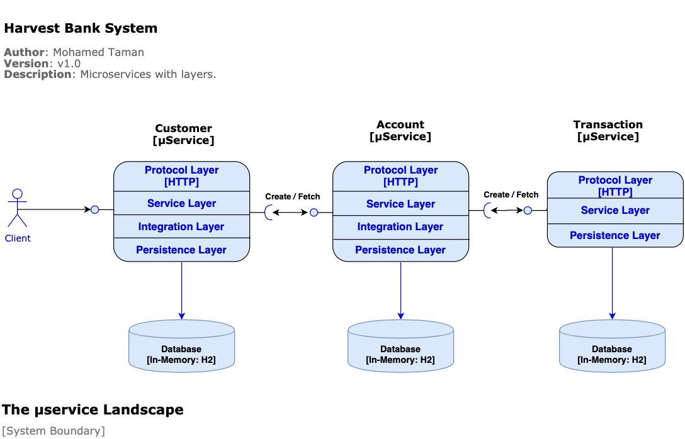

# Harvest Bank μServices  [](https://github.com/mohamed-taman/harvest-bank/releases) [](https://bettercodehub.com/)

A set of interacting microservices, representing a very basic banking system.

- This project is a development of a small set of **Spring Boot** projects, with a database in-memory.
---
## Better Code Hub
I analysed this repository according to the clean code standards on [Better Code Hub](https://bettercodehub.com/) just to get an independent opinion of how bad the code is. Surprisingly, the compliance score is high!

## Getting started

### Project Management
1. I have used GitHub projects to manage my tasks in the **Harvest Bank** project. [Project Link](https://github.com/mohamed-taman/Harvest-Bank/projects/1)
2. All MVP tasks are assigned to the **Harvest Bank MVP Milestone**. [Milestone Link](https://github.com/mohamed-taman/Harvest-Bank/milestone/1?closed=1)
3. I used Pull requests to manages and close my tasks. [Tasks Link](https://github.com/mohamed-taman/Harvest-Bank/issues?q=)
4. Finally, I have added releases to manage small features sprints until the final release v1.5. [Releases Link](https://github.com/mohamed-taman/Harvest-Bank/releases)

### System components Structure
Let's explain first the system structure to understand its components:
```
Harvest-Bank --> Parent folder. 
|- docs --> All docs and diagrams. 
|- bank-base 
  |- bank-build-chassis --> Super Parent POM, contains all build information, plugins and tools.
  |- bank-service-chassis --> Parent POM, inherits from build chassis contains all microservices common libraries.
|-bank-common --> API Endpoint and services definitions for all microservices, and common utilities shared between all components 
|-bank-services 
  |- account-service --> Account Microservice 
  |- customer-service --> Customer Microservice 
  |- transaction-service --> Transaction Microservice 
|- run-em-all.sh --> Run all microservices in separate mode. 
|- setup.sh --> Install all shared POMs and shared libraries. 
|- stop-em-all.sh --> Stop all services runs in standalone mode. 
|- test-em-all.sh --> This will start all Microservices landscape and test them, then shutdown Microservices after test finishes (use switch start and stop)
```
Now, as we have learned about different system components, then let's start.

### System Boundary - μServices Landscape



### Required software

The following are the initially required software pieces:
1. **Maven**: Apache Maven is a software project management and comprehension tool, it can be downloaded from here https://maven.apache.org/download.cgi
1. **Git**: it can be downloaded and installed from https://git-scm.com/downloads
1. **Java, JDK 15 RC**: it can be downloaded and installed from https://jdk.java.net/15/
1. **curl**: this command-line tool for testing HTTP-based APIs can be downloaded and installed from https://curl.haxx.se/download.html
1. **jq**: This command-line JSON processor can be downloaded and installed from https://stedolan.github.io/jq/download/

Follow the installation guide for each software website link and check your software versions from the command line to verify that they are all installed correctly.

## Using an IDE

I recommend that you work with your Java code using an IDE that supports the development of Spring Boot applications such as **Spring Tool Suite** or **IntelliJ IDEA Ultimate Edition**. 

So you can use the Spring Boot Dashboard to run the services, run each Microservice test case, and many more.

All you have to do is just fire up your favorit IDE **->** open or import the parent folder `Harvest-Bank`, and everything will be ready for you.

## Playing With Harvest Bank Project

### Cloning It

The first thing to do is to open **git bash** command line, and then simply you can clone the project under any of your favorite places as the following:

```bash
> git clone https://github.com/mohamed-taman/Harvest-Bank.git
```

### Build & Test Them In Isolation

To build and run the test cases for each service & shared modules in the project, we need to do the following:

#### First: Build & Install Shared Dependencies

> This done only for the first time or any new changes or versions of shared modules and POMs.

To build and install `bank-build-chassis`, and `bank-services-chassis` POMs, and `bank-common` shared library, from the root folder `Harvest-Bank`, run the following command:

```bash
mohamed_taman:Harvest-Bank$ ./setup.sh
```

Now you should expect output like this:

```bash
Installing all Harvest Bank core shared modules & Parent POMs
...............................................................

1- Installing [Parent Build Chassis] module...
Done successfully.

2- Installing shared [Services Utilities] module...
Done successfully.

3- Installing [Parent Services Chassis] module...
Done successfully.

Woohoo, building & installing all project modules are finished successfully.
The project is ready for the next step. :)
```
#### Second: Build & Test Microservices
Now it is the time to build our **3 microservices** and run each service unit and integration tests in isolation by running the following commands:

```bash
mohamed_taman:Harvest-Bank$ ./mvnw clean verify
```

All build commands and test suite for each microservice should run successfully, and the final output should be like this:

```bash
-------< org.siriusxi.blueharvest.bank:Harvest-Bank-aggregator >--------
[INFO] Building Harvest Bank Aggregator 1.0-SNAPSHOT                      [7/7]
[INFO] --------------------------------[ pom ]---------------------------------
[INFO] 
[INFO] --- maven-clean-plugin:2.5:clean (default-clean) @ Harvest-Bank-aggregator ---
[INFO] ------------------------------------------------------------------------
[INFO] Reactor Summary:
[INFO] 
[INFO] Harvest Bank Build Chassis 1.0-SNAPSHOT ............ SUCCESS [  0.131 s]
[INFO] Bank Common 0.0.1-SNAPSHOT ......................... SUCCESS [  1.917 s]
[INFO] Bank Services Chassis 1.0-SNAPSHOT ................. SUCCESS [  0.335 s]
[INFO] Customer Service 0.0.1-SNAPSHOT .................... SUCCESS [  9.717 s]
[INFO] Account Service 0.0.1-SNAPSHOT ..................... SUCCESS [  8.175 s]
[INFO] Transaction Service 0.0.1-SNAPSHOT ................. SUCCESS [  8.421 s]
[INFO] Harvest Bank Aggregator 1.0-SNAPSHOT ............... SUCCESS [  0.032 s]
[INFO] ------------------------------------------------------------------------
[INFO] BUILD SUCCESS
[INFO] ------------------------------------------------------------------------
[INFO] Total time:  28.964 s
[INFO] Finished at: 2020-09-07T14:13:11+02:00
[INFO] ------------------------------------------------------------------------
```

### Running Them All
Now it's the time to run all of our Microservices, and it's straightforward, just run the following commands:

```bash
mohamed_taman:Harvest-Bank$ ./run-em-all.sh
```

All the **services**, In-memory **databases**, will run in parallel in a detach mode, and the command output will print the following to console:

```bash
Starting [Harvest Bank] μServices ....
---------------------------------------

Starting [account-service] μService....       Done 
Starting [customer-service] μService....      Done 
Starting [transaction-service] μService....   Done
```
### Access Bank APIs
You can manually test the whole system through `Customer Service` APIs within its **OpenAPI
** interface at the following URL [http://localhost:8090/swagger-ui.html](http://localhost:8090/swagger-ui.html)

#### System Behaviours
1. If you execute get customers through `/bank/api/v1/customers`, it will return pre-defined seven customers.
2. If you tried to pass through `/bank/api/v1/customers/{id}/accounts` the following: 
    1. A none exist customer {Id} system will return **404** (*Not Found*) with error message.
    2. A minus customer {Id} or Initial Credit, System will return **422** (*Unprocessable Entity*) with an error message.
    3. An invalid format customer {Id} or Initial Credit, System will return **400** (*Bad Request*) with an error message.
3. If the initial credit is 0.0, the system expects to create an account and no transaction.
4. If the initial credit is > 0.0, i.e., 100, The system is expected to create a new account with a balance of 100. A new transaction with the amount of 100 and customer balance will be 100.
5. Suppose another create account call happened to the same customer. In that case, the system will do what is done at point **#4**. The customer balance will be *updated* to reflect the sum of all accounts balances and transaction amounts. 

### Stopping Them All
Now it's the time to stop all of our Microservices, and it's straightforward, just run the following commands:

```bash
mohamed_taman:Harvest-Bank$ ./stop-em-all.sh
```

All the **services** will shutdown, and the command output will print to the following to console:

```bash
Stopping [Harvest Bank] μServices ....
---------------------------------------

Stopping μService at port 8090 ....
{"message":"Shutting down, bye..."}
μService at port 8090 stopped successfully .... 

Stopping μService at port 8091 ....
{"message":"Shutting down, bye..."}
μService at port 8091 stopped successfully .... 

Stopping μService at port 8092 ....
{"message":"Shutting down, bye..."}
μService at port 8092 stopped successfully ....
```
### Testing Them All
Now it's time to test all the application functionality as one part. To do so just run the following automation test script:

```bash
mohamed_taman:Harvest-Bank$ ./test-em-all.sh start stop
```

You can use `stop` switch with `start`, that will 
1. **Start** the whole microservices landscape, 
2. **Run** the system black-box tests, if successful then 
3. **Stop** the whole microservices.

The result will look like this:

```bash
Starting 'Harvest Bank μServices' for [end-2-end] testing....

Start Tests: Mon Sep  7 17:27:09 CEST 2020
HOST=localhost
PORT=8090
Firing up the test environment...

Starting [Harvest Bank] μServices ....
---------------------------------------

Starting [account-service] μService.... Done 

Starting [customer-service] μService.... Done 

Starting [transaction-service] μService.... Done 

Wait for: curl http://localhost:8090/actuator/health ... , retry #1 , retry #2 , retry #3 , retry #4 {"status":"UP","components":{"db":{"status":"UP","details":{"database":"H2","validationQuery":"isValid()"}},"diskSpace":{"status":"UP","details":{"total":1000345825280,"free":610842566656,"threshold":10485760,"exists":true}},"ping":{"status":"UP"}}}
 DONE, continues...

Test OK (HTTP Code: 200)
Test OK (actual value: 7)
Test OK (actual value: 0)
Test OK (actual value: 0)
Test OK (HTTP Code: 404, {"status":"NOT_FOUND","message":"No Customer found for id {14}","timestamp":"2020-09-07@17:27:22.914+0200"})
Test OK (HTTP Code: 422, {"status":"UNPROCESSABLE_ENTITY","message":"Invalid data (Customer Id= 14, initialCredit= -10.00)","timestamp":"2020-09-07@17:27:22.961+0200"})
Test OK (HTTP Code: 400, {"timestamp":"2020-09-07T15:27:22.985+00:00","status":400,"error":"Bad Request","message":"Failed to convert value of type 'java.lang.String' to required type 'int'; nested exception is java.lang.NumberFormatException: For input string: \"invalidCustomerId\"","path":"/bank/api/v1/customers/invalidCustomerId/accounts"})
Test OK (actual value: "Bad Request")
Test OK (HTTP Code: 200)
Test OK (HTTP Code: 200)
Test OK (actual value: 1)
Test OK (actual value: 0)
Test OK (actual value: 0)
Test OK (HTTP Code: 200)
Test OK (HTTP Code: 200)
Test OK (actual value: 100.2)
Test OK (actual value: 2)
Test OK (actual value: 100.2)
Test OK (actual value: 1)
Test OK (actual value: 100.2)
Test OK (HTTP Code: 200)
Test OK (HTTP Code: 200)
Test OK (actual value: 200)
Test OK (actual value: 3)
Test OK (actual value: 99.8)
Test OK (actual value: 1)
Test OK (actual value: 99.8)

End, all tests OK: Mon Sep  7 17:27:24 CEST 2020 

We are done, stopping the test environment...

Stopping [Harvest Bank] μServices ....
---------------------------------------

Stopping μService at port 8090 ....
{"message":"Shutting down, bye..."}
μService at port 8090 stopped successfully .... 

Stopping μService at port 8091 ....
{"message":"Shutting down, bye..."}
μService at port 8091 stopped successfully .... 

Stopping μService at port 8092 ....
{"message":"Shutting down, bye..."}
μService at port 8092 stopped successfully .... 
```

### Closing The Story

Finally, hope you enjoyed the application and find it useful. If you would like to enhance please open **PR**, and finally give it a 🌟.

## The End
Happy Coding 😊 

## License
Copyright (C) 2020 Mohamed Taman, Licensed under the **Apache-2.0 License**.

